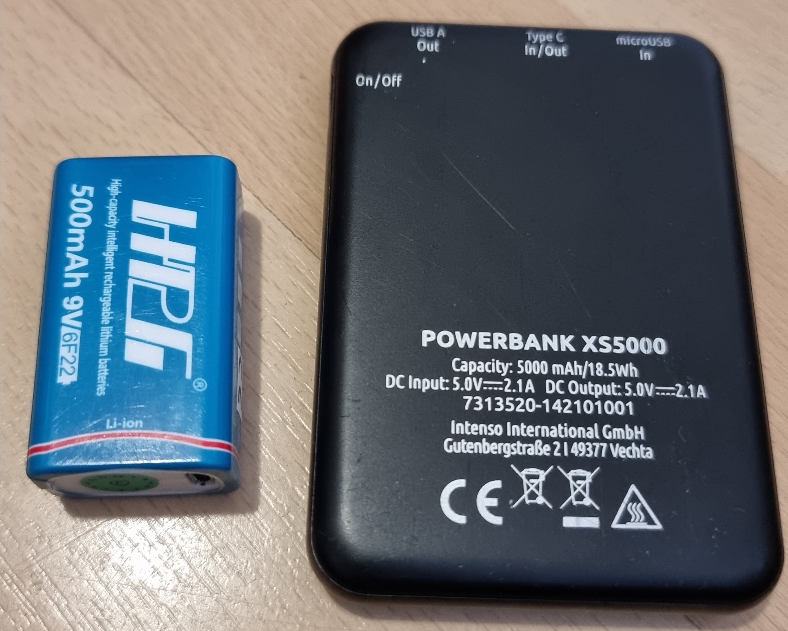

# Autonomous-Car
The project deals with an autonomous car equipped with Raspberry pi and Arduino board along side with DC motors, RPLidar and a Camera. The aim of the project is to learn the operations of RPLidar and Pi camera. The project includes tasks like mapping using RPLidar, object detection and path following using Pi camera. The final task consists of driving the car on a track wehre the Pi camera leads the car by following the white line on the center of the track, and RPLidar makes sure the car is not moving into any obstracle. 
  
The DC motors are powered by 9V 500mAH rechargeable Lithium battery. And the power source for the Raspberry Pi is given by a 5000mAH / 18.5Wh Powerbank.

